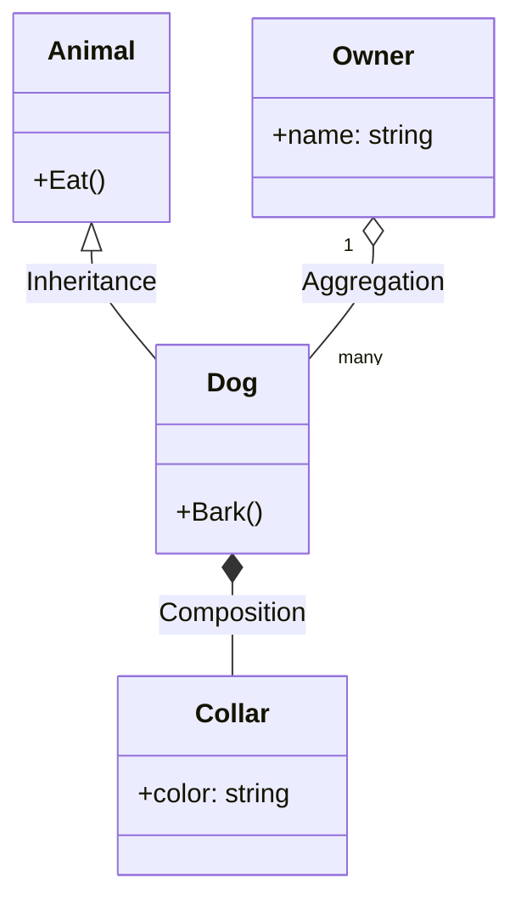
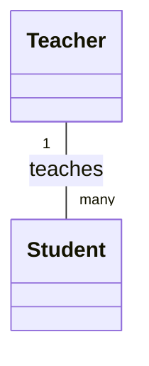
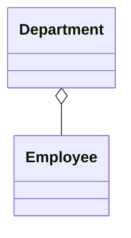
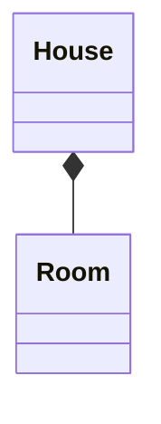
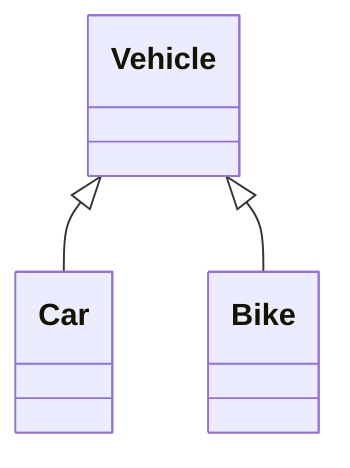
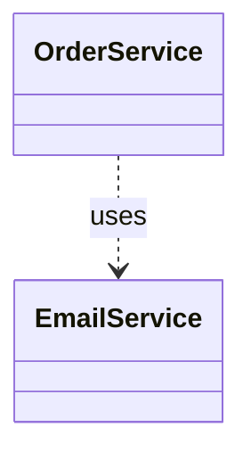
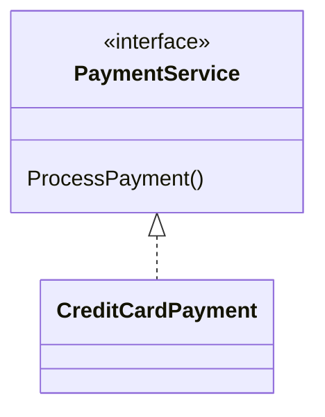
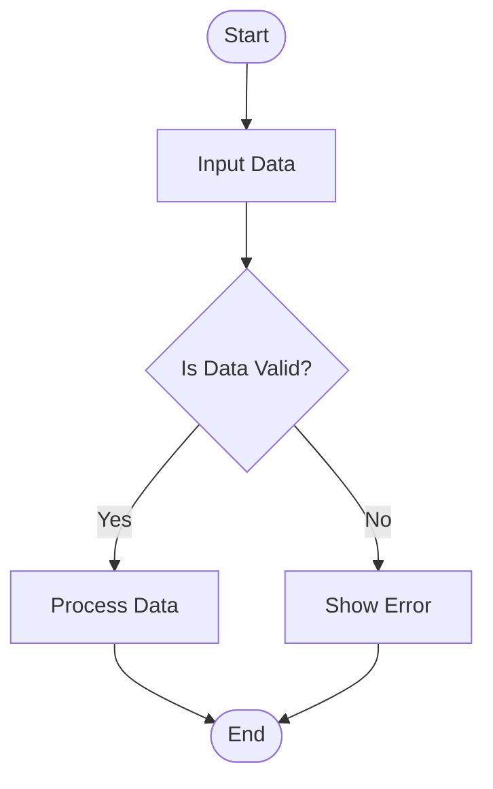
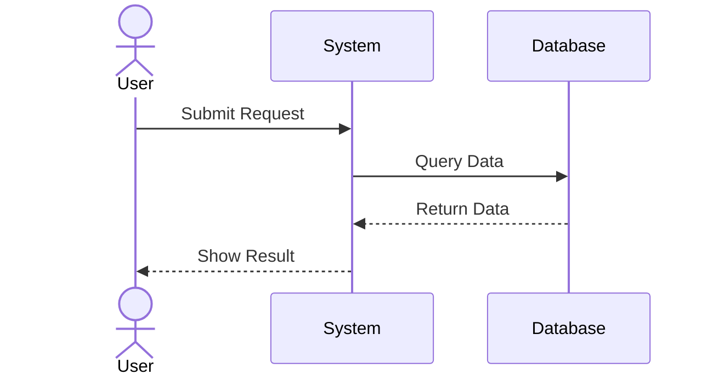
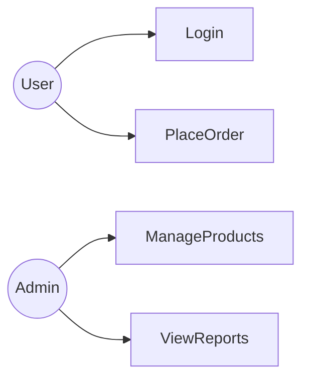

# UML Diagrams

This document explains the most commonly used **Unified Modeling Language (UML)** diagrams used in **Object-Oriented Analysis and Design (OOAD)**.
It includes **notations, symbols, and annotated examples**.


## Table of Contents

1. UML Diagram Common Symbols
2. Class Diagram
3. Relationship Types in Class Diagrams
4. Flow Diagram (Activity / Flowchart)
5. Sequence Diagram
6. Use Case Diagram


## 1. UML Diagram Common Symbols

| Symbol                    | Meaning                                |
| ------------------------- | -------------------------------------- |
| Rectangle                 | Class                                  |
| Solid Line                | Association                            |
| Hollow Diamond            | Aggregation                            |
| Filled Diamond            | Composition                            |
| Hollow Triangle           | Inheritance / Generalization           |
| Dashed Line Arrow         | Dependency                             |
| Dashed Line with Triangle | Realization (Interface implementation) |
| +                         | Public                                 |
| -                         | Private                                |
| #                         | Protected                              |
| ~                         | Package                                |

Example class structure:

```
+-------------------+
|      ClassName    |
+-------------------+
| -attribute1       |
| +attribute2       |
+-------------------+
| +method1()        |
| -method2()        |
+-------------------+
```


## 2. Class Diagram

### Purpose

A **Class Diagram** represents the **static structure of the system**, showing:

* Classes
* Attributes
* Methods
* Relationships between classes

It is one of the **most important UML diagrams** in OOAD.


### Example Class Diagram




 Explanation

| Notation | Meaning     |
| -------- | ----------- |
| `<--`    | Inheritance |
| `o--`    | Aggregation |
| `*--`    | Composition |
| `"1"`    | One         |
| `"many"` | Multiple    |


## 3. Relationship Types in Class Diagrams

Understanding relationships is **critical in OO design**.


### 3.1 Association

**Definition:**  Association represents a relationship between two independent classes where one object uses or interacts with another.

A **basic relationship between two classes**.

Association can be:
- One-to-One
- One-to-Many
- Many-to-Many

Example:
A **Teacher teaches Students**.




### 3.2 Aggregation (Has-A)

**Definition:** Aggregation is a special form of association that represents a "has-a" relationship where the child can exist independently of the parent. It is a weak association.

Represents **whole–part relationship**, but parts **can exist independently**.

Example:

A **Department has Employees**.



Meaning:
If the **Department is deleted**, employees still exist.


### 3.3 Composition (Strong Has-A)

**Definition:** Composition is a strong form of association where the child cannot exist independently of the parent. If the parent is destroyed, so are the children.

Stronger relationship where **child cannot exist without parent**.

Example:

A **House contains Rooms**.



Meaning:

If the **House is destroyed**, Rooms are destroyed.


### 3.4 Inheritance (Is-A)

Represents **parent-child hierarchy**.

Example:



Meaning:

* Car **is a** Vehicle
* Bike **is a** Vehicle


### 3.5 Dependency

Represents **temporary usage relationship**.

Example:



Meaning:

OrderService **depends on EmailService**.


### 3.6 Interface / Realization

Represents **interface implementation**.

Example:



Meaning:

`CreditCardPayment` implements `PaymentService`.


## 4. Flow Diagram (Activity / Flowchart)

### Purpose

A **Flow Diagram** represents **control flow of operations** or **process steps**.

Used to visualize:

* Business processes
* Algorithms
* Decision logic

### Symbols

| Symbol        | Meaning        |
| ------------- | -------------- |
| Oval          | Start / End    |
| Rectangle     | Process        |
| Diamond       | Decision       |
| Arrow         | Flow direction |
| Parallelogram | Input / Output |


Example



## 5. Sequence Diagram

### Purpose

A **Sequence Diagram** shows **how objects interact over time**.

It focuses on:

* Order of messages
* Interaction between objects
* System behavior in a scenario


### Symbols

| Symbol        | Meaning                    |
| ------------- | -------------------------- |
| Actor         | External user/system       |
| Lifeline      | Object existence over time |
| Activation    | Processing period          |
| Message Arrow | Communication              |
| Return Arrow  | Response                   |


Example



Explanation

| Notation      | Meaning          |
| ------------- | ---------------- |
| `actor`       | External user    |
| `participant` | System component |
| `->>`         | Message          |
| `-->>`        | Return message   |


## 6. Use Case Diagram

### Purpose

A **Use Case Diagram** describes **system functionality from the user's perspective**.

It identifies:

* Actors
* Use cases
* Relationships


Example




Explanation

| Element  | Meaning                                 |
| -------- | --------------------------------------- |
| Actor    | External entity interacting with system |
| Use Case | System functionality                    |
| Line     | Interaction                             |


## Summary

The most important UML diagrams in OOAD are:

| Diagram                 | Purpose                 |
| ----------------------- | ----------------------- |
| Class Diagram           | System structure        |
| Sequence Diagram        | Object interactions     |
| Activity / Flow Diagram | Process flow            |
| Use Case Diagram        | User-system interaction |

